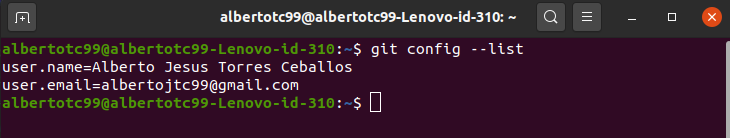
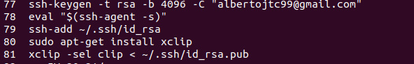
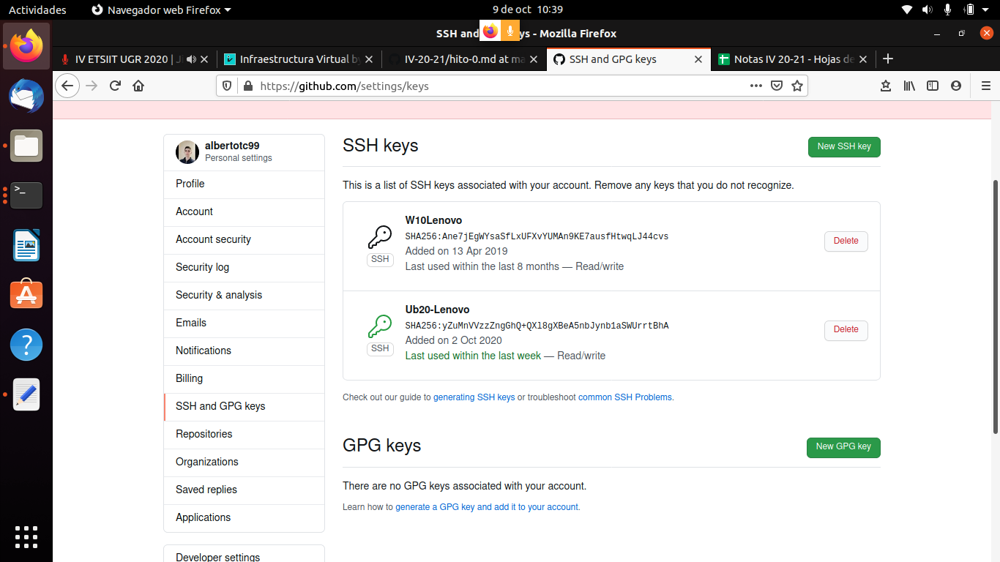

## Configuración git
### Configuración nombre y correo
Simplemente ejecuté las siguientes órdenes:

` git config --global user.name "Alberto Jesus Torres Ceballos"
  git config --global user.mail "albertojtc99@gmail.com" `
  
Con ` git config --list ` compruebo la configuración:

### Creación par de claves y subida clave pública a GitHub:
Siguiendo este [tutorial](https://docs.github.com/en/free-pro-team@latest/github/authenticating-to-github/generating-a-new-ssh-key-and-adding-it-to-the-ssh-agent) creé las claves y copié la pública al portapapeles:

 
 
 Después solo quedaba copiar la pública en GitHub (ya tenía una añadida, la nueva es Ub20-Lenovo) como en este [tutorial](https://docs.github.com/en/free-pro-team@latest/github/authenticating-to-github/adding-a-new-ssh-key-to-your-github-account):
 
 
